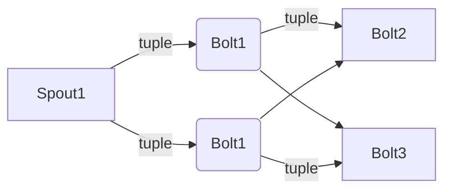

# Storm Concept

## Tuple
A tuple is the stucture used by component communication, which can cantain multiple ordered kv elements.

## Stream
A stream is an unbounded sequence of tuples.

## Component
Component is the abstract concept of the base computing unit, it is including two type, spout , bolt.

## Parallelism
Parallelism define the concurrent of the component running. 

## Spout
A spout is a source of streams. Generally spouts will read tuples from an external source and emit them to bolt.

## Bolt
A bolt is doing all other processing. Generally bolts will get tuples from spout and do anything from filtering, functions, aggregations, joins, talking to databases, and more.

## Stream groupings
a stream grouping define the connection of the component, means a component take which other component as its input stream.

## Topology
Topology is a never end application packaging spouts, bolts and their grouping. 
Example topology as below:



## Node
A node is a physical machine.

## Assignment
a assignment is define how the topology componet assign to node. use above examle,
assignment maybe as below: 

| Node1  | Node2  |
| :---   | :----  |
| spout1 | bolt1  |
| bolt1  | bolt3  |
| bolt2  |        |

## Task
A task is a runing componet.

## Executor
Tasks is running in a executor. Each executor run in a single thread.

## Worker
Worker is contain executors. Each worker run in a single JVM.

## Slot
// todo


## Nimbus
Nimbus is a master node of Storm cluster. It is responsible for distributing data among all the worker nodes, assign tasks to worker nodes and monitoring failures. The new Storm support the Nimbus HA.


## Supervisor
// todo


## Mode
storm can run in local mode or distributed mode.

### local mode
- local mode is for topology development and local test, example:

```java
import org.apache.storm.LocalCluster;
// ...
try (LocalCluster cluster = new LocalCluster()) {
    //Interact with the cluster...
}
```

- In local mode, zookeeper, supervisor, nimbus and worker would run in same JVM.

### distributed mode
- the normal running mode.
- need to deploy the zookeeper cluster first. 
- then depoly the nimbus, supervior, ui process in multiple machine
- so topology can scala out.