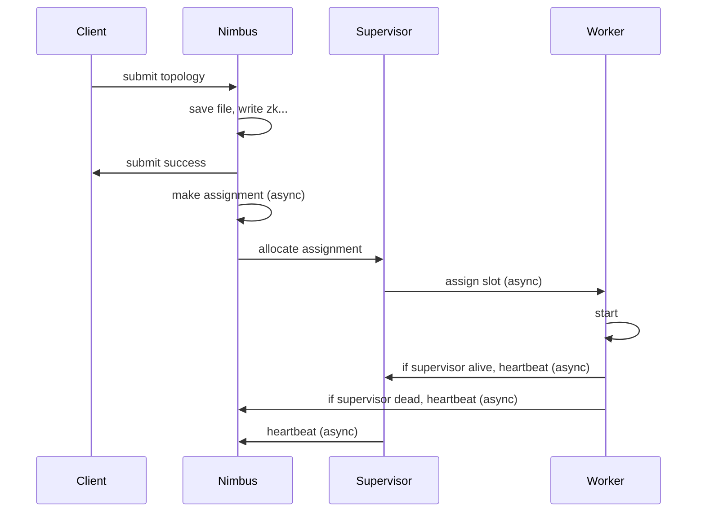

# Storm Flow

- Sequence Diagram: get a big picture of the flow
- Stack: help to debug the code, because of so much async loop

## Topology Submit

### sequence Diagram:


### stack:
```
// cleint side
bin/storm jar your-jar main-class
bin/storm.py
// run your submit jar with main class
new TopologyBuilder()
TopologyBuilder.createTopology()
StormSubmitter.submitTopology()

//Nimbus side
StormSubmitter.submitTopologyAs()
// do some checking, upload dependent jar, upload jar
Nimbus.submitTopologyWithOpts()
// do some checking, 
// normailize topology : add sys bolt to topology
// save the code and conf and jar to blobStore (local file system)
// multiple nimbus need to sync the blobStore 
// write topology info to zk
// response to client

Async Loop: 
Nimbus.mkAssignments()
// Sechduler to calc the cluster assignments
// update the assignment to zk
Nimbus.notifySupervisorsAssignments()

Async Loop:
AssignmentDistributionService.sendAssignmentsToNode()
// allocate the assinment to supervisor

// Supervisor side
Nimbus.getSupervisorAssignments()
// Nimbus get assignment form local cache

Async Loop:
ReadClusterState.run()
Slot.setNewAssignment()
Slot.addProfilerActions

Async Loop:
Slot.run()
DynamicState.stateMachineStep()
Slot.handleWaitingForBlobLocalization()
staticState.containerLauncher.launchContainer()
Container.setup();
Container.launch();
// start worker with process builder

//Logwriter start
//Worker Start
```

## worker run

