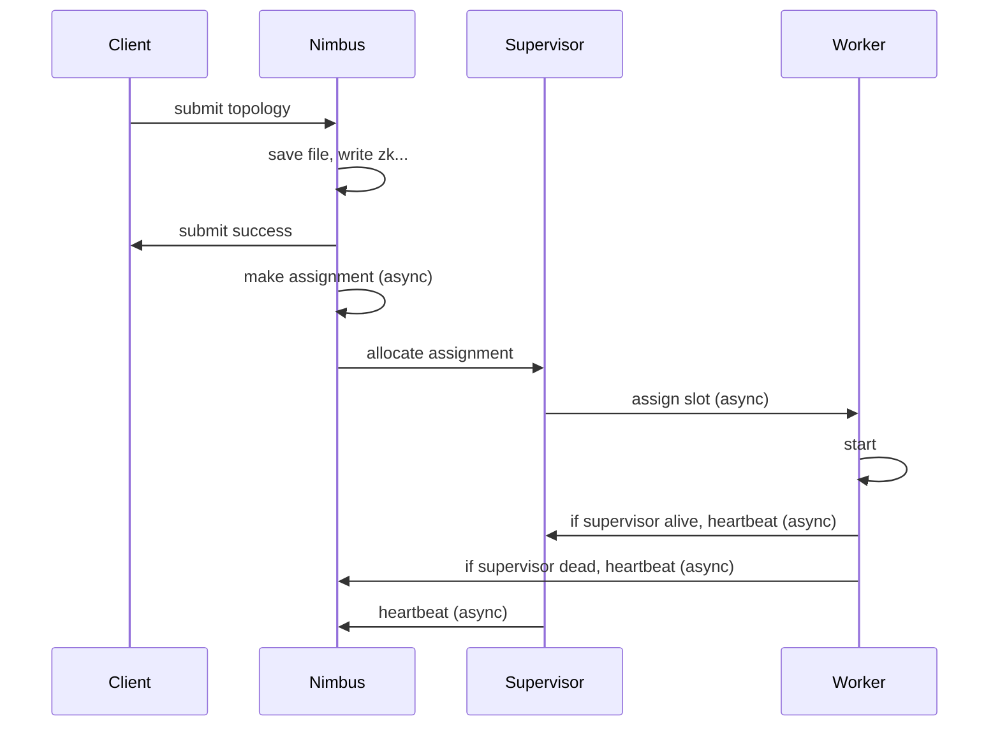
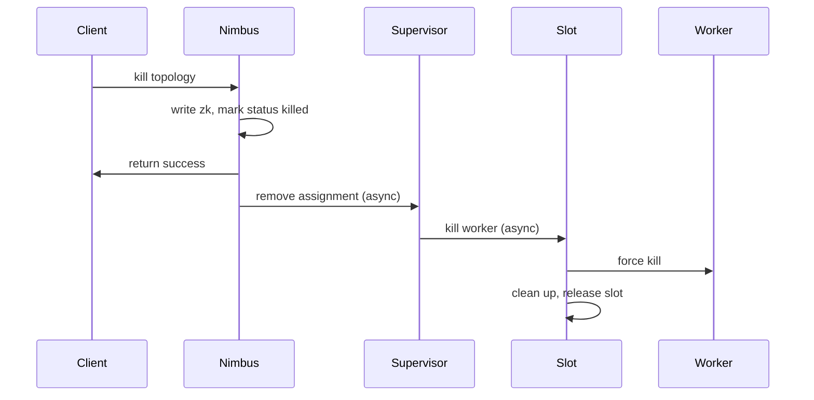

# Storm Flow

- Sequence Diagram: get a big picture of the flow
- Stack: help to debug the code, because of so much async loop

## Topology Submit

### sequence Diagram:


### stack:
```
// cleint side
bin/storm jar your-jar main-class
bin/storm.py
// run your submit jar with main class
new TopologyBuilder()
TopologyBuilder.createTopology()
StormSubmitter.submitTopology()

//Nimbus side
StormSubmitter.submitTopologyAs()
// do some checking, upload dependent jar, upload jar
Nimbus.submitTopologyWithOpts()
// do some checking, 
// normailize topology : add sys bolt to topology
// save the code and conf and jar to blobStore (local file system)
// multiple nimbus need to sync the blobStore 
// write topology info to zk
// response to client

Async Loop: 
Nimbus.mkAssignments()
// Sechduler to calc the cluster assignments
// update the assignment to zk
Nimbus.notifySupervisorsAssignments()

Async Loop:
AssignmentDistributionService.sendAssignmentsToNode()
// allocate the assinment to supervisor

// Supervisor side
Nimbus.getSupervisorAssignments()
// Nimbus get assignment form local cache

Async Loop:
ReadClusterState.run()
Slot.setNewAssignment()
Slot.addProfilerActions

Async Loop:
Slot.run()
DynamicState.stateMachineStep()
Slot.handleWaitingForBlobLocalization()
staticState.containerLauncher.launchContainer()
Container.setup();
Container.launch();
Slot.handleWaitingForWorkerStart()
Slot.handleRunning()

//Async 
// start worker with process builder
//Logwriter start
//Worker Start
```

## Topology Kill

### sequence Diagram:


### stack:
```
//client side:
storm kill topology-name
bin/storm.py

//nimbus side:
Nimbus.killTopologyWithOpts()
Nimbus.transitionName()
// TOPO_STATE_TRANSITIONS.get("ACTIVE").get("KILL")
KILL_TRANSITION
clusterState.updateStorm()

// Async
Nimbus.transitionName()
// TOPO_STATE_TRANSITIONS.get("KILLED").get("REMOVE")
REMOVE_TRANSITION
notifySupervisorsAsKilled()
notifySupervisorsAssignments()

Async Loop:
AssignmentDistributionService.sendAssignmentsToNode()
// allocate the assinment to supervisor

//supervisor side:
Nimbus.getSupervisorAssignments()
// Nimbus get assignment form local cache

Async Loop:
ReadClusterState.run()
Slot.setNewAssignment()
Slot.addProfilerActions

Async Loop:
Slot.run()
DynamicState.stateMachineStep()
Slot.handleKill()
```

## worker run

### stack:
```
//local mode start from start()
Worker.main() 
Worker.start()
Worker.loadWorker()

Executor.mkExecutor()
Executor.execute()

// async Loop
// SpoutExecutor
SpoutExecutor.call()
SpoutExecutor.init()
spoutObject.open()

// SpoutExecutor.call()
// anonymous call()
    for (int j = 0; j < spouts.size(); j++) { // in critical path. don't use iterators.
        spouts.get(j).nextTuple();
    }
SpoutOutputCollector.emit()
SpoutOutputCollectorImpl.emit()
SpoutOutputCollectorImpl.sendSpoutMsg()
ExecutorTransfer.tryTransfer()
workerData.tryTransferRemote()
or workerData.tryTransferLocal()


// async Loop
// BoltExecutor
BoltExecutor.call()
BoltExecutor.init()
BoltObject.prepare()

// BoltExecutor.call()
// anonymous call()
receiveQueue.consume
JCQueue.consumeImpl()
Consumer.accept()
Executor.tupleActionFn()
Bolt.tupleActionFn()
boltObject.execute(tuple);

BasicOutputCollector.emit()
BoltOutputCollectorImpl.emit()
BoltOutputCollectorImpl.boltEmit()
ExecutorTransfer.tryTransfer()
// as same as spout

```

## nimbus thrift init

### stack:
Nimbus.main()
Nimbus.launch()
Nimbus.launchServer()
new ThriftServer()
AuthUtils.getTransportPlugin()

default: SimpleTransportPlugin

getServer()
// bind 0.0.0.0
// maxBufferSize , is used to avoid unvalid connect making oom exception , like http.

## worker netty init

### stack:
Worker.main()
Worker.start()
Worker.loadWorker()
new WorkerState() // context = null
TransportFactory.makeContext() // default: org.apache.storm.messaging.netty.Context
mqContext.bind()
new Server()
new StormServerPipelineFactory()
new StormServerHandler()